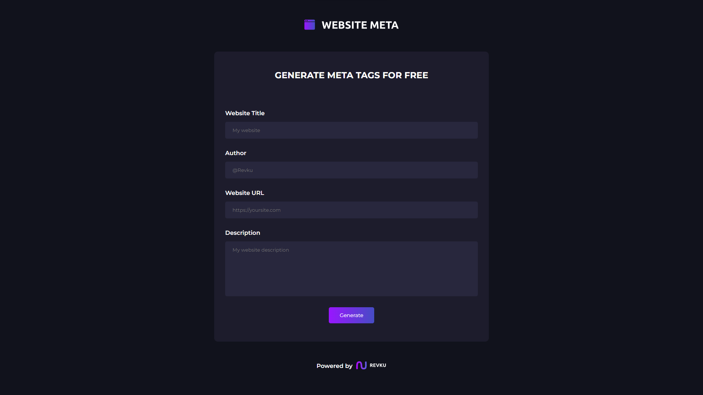
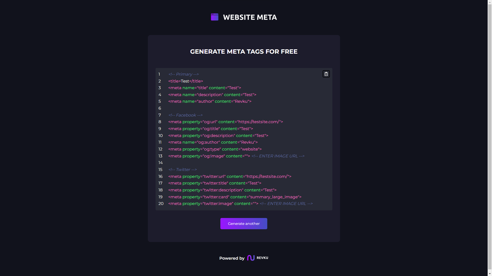

# 🌍 Website Meta
Website Meta is free apliacation where you can generate meta tags for your website. With this free app, you don't have to worry about your website SEO anymore.

## 🔧 Tech stack
- create-react-app  
- css modules  
- react-code-blocks  
- sass  

## 👋 Getting Started
1. Clone the repository
```
git clone https://github.com/Revku/website-meta
```
2. Install all depencencies
```
npm install
```
3. Start application
```
npm start
```

## 📸 Screenshots


